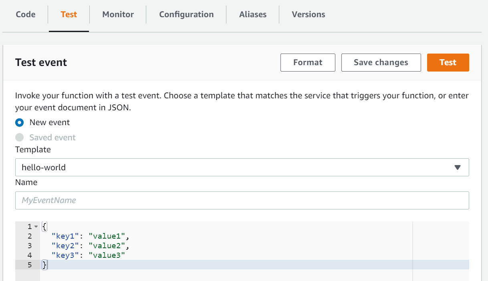
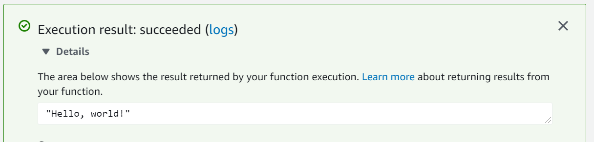

# Overview

This is a Kotlin multiplatform template project used to generate and deploy a natively compiled AWS Lambda function
using a custom runtime. Using a natively compiled image greatly improves startup and execution time, and reduces memory
consumption, relative to relying on the Java Virtual Machine. By using
the [graalvm-native compiler](https://www.graalvm.org/reference-manual/native-image/), the Lambda function can continue
to utilize the AWS Java SDK and other JVM libraries.

It includes the following:

* A "Hello, world" AWS lambda function implemented with Kotlin and using the AWS Java SDK
* Use of the ShadowJar gradle plugin to create a single JAR file with the lambda function and all dependencies
* Creates a Docker image using amazonlinux to be used by the native compilation step
* Uses the graalvm native compiler to create a binary executable that can be run in an AWS custom lambda runtime
* Uses the AWS CDK to deploy the lambda function to the server

# Build and Deploy

### 1. Install the [AWS Cloud Development Kit (CDK)](https://aws.amazon.com/cdk/)

### 2. Install [Docker](https://www.docker.com/)

### 3. Build and deploy the lambda function to AWS

`cd deploy`

If using windows:

`cdk --profile <awsprofile> deploy --app "..\gradlew run"`

if using linux:

`cdk --profile <awsprofile> deploy --app "../gradlew run"`

where `<awsprofile>` should be replaced with
the [profile](https://docs.aws.amazon.com/cli/latest/userguide/cli-configure-profiles.html)
you wish to use for deploying to AWS.

When a prompt displays asking if you wish to deploy the changes, select 'y'.

# Testing

Log in to the AWS Lambda console. Navigate to the "helloWorld" function. From here choose the Test tab. It should look
like the below image:

For Template, use hello-world (it should be selected by default), and press the Test button.

The lambda function will return the String "Hello, world!" and is reported by the AWS console as shown in the below
image:

